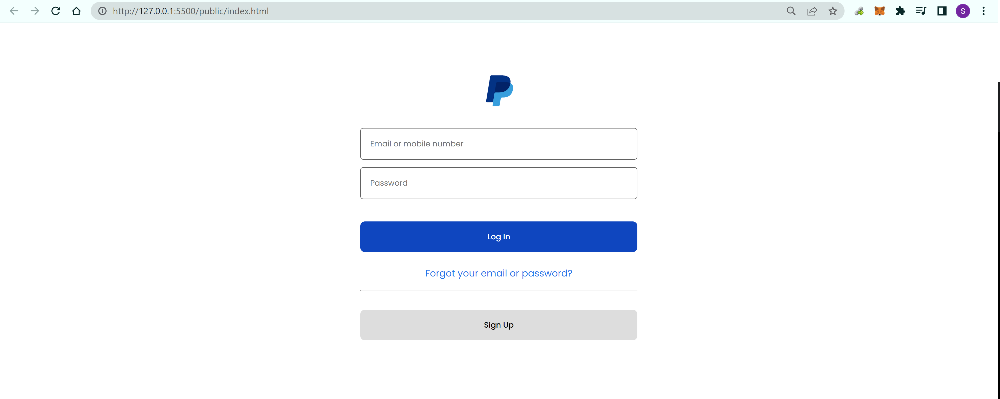

# Phishing Website Demo
Backend and frontend of a fake PayPal login page to illustrate the architecture and implementation of a phishing website.



## Disclaimer
**This project is created for education and illustration purposes only. The author is completely not responsible for any misuse.**

## Usage

1. Install dependencies

    ```
    npm install
    ```

2. Replace `<DB_CONNECTION_STRING>` and `<DB_PASSWORD>` in `config.env` with the connection string and password of your MongoDB instance.

3. Start the server

    ```
    node server.js
    ```

## Acknowledgement

The frontend HTML/CSS is recreated from [github.com/pingAvisek/paypalLoginCloneCSS](https://github.com/pingAvisek/paypalLoginCloneCSS)